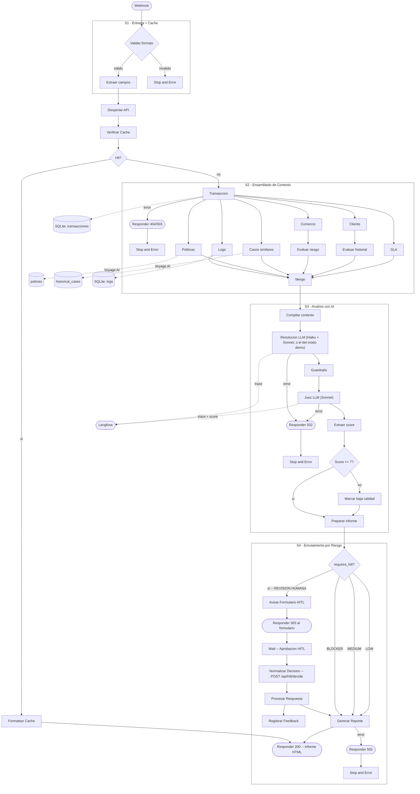

# Arquitectura — Agente de Contracargos CIRI

## Tabla de Contenidos

1. [Vision General](#vision-general) -- Patron de arquitectura
2. [Orquestacion Explicita con n8n](#orquestacion-explicita-con-n8n)
3. [Diagrama Completo](#diagrama-completo)
4. [Modo Demo: Evaluar Sin Gastar](#modo-demo-evaluar-sin-gastar)
5. [El Principio Central: El Codigo Decide, el LLM Explica](#el-principio-central-el-codigo-decide-el-llm-explica)
6. [Modularidad](#modularidad)
7. [Escalabilidad](#escalabilidad)
8. [Flujo de Datos](#flujo-de-datos)
9. [Decisiones de Arquitectura (ADR)](#decisiones-de-arquitectura-adr)
10. [Consideraciones de Seguridad](#consideraciones-de-seguridad)

---

## Vision General

### Patron de Arquitectura

**Orquestacion explicita con herramientas aumentadas por LLM** -- a veces llamado *Pipeline Agentico*.

Esto no es un Agente de IA clasico. En un agente clasico, el LLM decide que herramientas llamar y en que orden. Aca, **n8n decide el flujo de forma explicita** -- 46 nodos (40 ejecutables + 6 sticky notes), siempre la misma secuencia, completamente auditable. El LLM solo razona sobre los datos que recibe; nunca controla el camino de ejecucion.

| | Agente IA clasico | Este sistema |
|---|---|---|
| Quien decide el flujo | El LLM | n8n (explicito, 46 nodos) |
| Auditabilidad | Caja negra | Cada paso es un nodo visible |
| Determinismo | No garantizado | Siempre la misma secuencia |
| Debugging | Dificil | Nodo por nodo en el canvas |

El LLM tiene un rol acotado y deliberado: evalua cumplimiento de politicas (Haiku), sintetiza una resolucion con razonamiento (Sonnet) y actua como juez de calidad (Sonnet). Nunca orquesta.

---

El sistema se compone de capas con **una responsabilidad unica y claramente delimitada**:

| Capa | Tecnologia | Responsabilidad |
|---|---|---|
| Orquestacion | n8n (46 nodos: 40 exec + 6 sticky) -- Cloud o self-hosted | QUE hacer y CUANDO -- webhook, secuenciamiento, control de flujo, visibilidad de guardrails, enrutamiento por riesgo |
| Logica de negocio | FastAPI (Render free tier) | COMO -- RAG retrieval, sintesis de resolucion con guardrails, feedback, auto-indexing |
| Almacen semantico | Qdrant Cloud (free tier) | Verdad no estructurada -- politicas y casos historicos |
| Almacen estructurado | SQLite | Verdad relacional -- transacciones, logs, feedback, audit trail |
| LLM (eval. politicas) | Claude Haiku 4.5 via FastAPI | Evaluacion de cumplimiento de politicas (rapido, economico) |
| LLM (sintesis + juez) | Claude Sonnet via FastAPI | Sintesis de resolucion + Judge de calidad 1-10 (razonamiento fuerte) |
| Embeddings | Voyage AI (free tier) | `voyage-multilingual-2` (1024 dims, multilingual) |
| Observabilidad | Langfuse | Tokens, latencia, scores del juez, tasa de cache hits |

**Principio central:** n8n sabe QUE y CUANDO; usa nodos nativos (Set, IF, Switch, Merge) para logica deterministica. FastAPI maneja RAG, sintesis LLM con guardrails, feedback y la evaluacion del Juez. Todas las llamadas LLM pasan por FastAPI para observabilidad consistente y versionado de prompts.

### Stack y restricciones de infraestructura

El sistema esta disenado para funcionar dentro de los limites de servicios gratuitos:

- **n8n Cloud** (trial): orquestacion visual, webhook publico, HITL con Wait nodes
- **Render** (free tier): la API se duerme tras 15 minutos de inactividad. El workflow incluye un nodo `[Despertar API]` que hace `GET /health` antes de cualquier llamada para manejar el cold start
- **Qdrant Cloud** (free tier): 1GB de almacenamiento, suficiente para las 3 colecciones del sistema. Los clusters gratuitos se suspenden tras una semana sin uso y se borran a las cuatro, asi que hay dos defensas: el arranque de la API tolera que Qdrant no responda (`dependencies.py` — levanta igual y lo registra, en vez de morir en el lifespan), y un workflow semanal de GitHub Actions (`.github/workflows/keep-alive.yml`) hace una busqueda real contra el cluster para que no llegue a suspenderse
- **Voyage AI** (free tier): embeddings multilingues. El sistema usa batch embedding (1 API call para policies + cases) para minimizar consumo

Estas restricciones no son ideales, pero el sistema las maneja de forma transparente. En produccion se reemplazarian por instancias dedicadas sin cambiar una linea de codigo.

**Degradacion parcial, no caida total.** Que un servicio externo falle no puede tumbar el resto. Si Qdrant no esta, la API arranca igual: el panel responde, los casos demo se sirven completos (no tocan el vector store) y solo las busquedas semanticas fallan, cada una con su propio error. `GET /health` reporta el estado real de cada dependencia en vez de fingir que esta todo bien. Fijado por `tests/integration/test_arranque_sin_qdrant.py`.

---

## Orquestacion Explicita con n8n

Los cuatro diagramas de la raiz de la entrega estan numerados en orden de lectura: primero
QUE hace el circuito, despues COMO se hablan las dos piezas.

**El flujo completo, navegable:** el diagrama **«el circuito completo»** es una pagina
autocontenida con los 39 pasos en orden de ejecucion, cada conexion trazada, el endpoint que
llama cada nodo y una ficha explicativa al tocarlos. Se genera desde el propio JSON del
workflow, no a mano, asi que no puede quedar desfasado del flujo real.

**Como se hablan n8n y la API:** el diagrama **«n8n y la API»** resume la conversacion — las
catorce llamadas en orden, que toca cada una y las dos veces que va al reves.

**El RAG, de punta a punta:** el diagrama **«el RAG»** sigue la cadena de recuperacion con un caso real del dataset — que entra al indice y que no, como el codigo arma la consulta, por que las dos colecciones se buscan con criterios opuestos, y los dos caminos por los que el indice se reescribe sin deploy. El desarrollo escrito esta en [`rag_explanation.md`](rag_explanation.md).

El workflow contiene **46 nodos (40 ejecutables + 6 sticky notes) organizados en 4 etapas**. No hay nodo AI Agent, no hay caja negra, no hay tool calling decidido por un LLM. Cada paso es un nodo visible con un proposito especifico -- nodos nativos de n8n (IF, Switch, Merge, Wait) para el control de flujo, nodos HTTP Request para todo lo que sea logica de negocio. Ningun umbral de negocio vive en el canvas: los limites de SLA por pais, los ratios de contracargo y las reglas de reincidencia se consultan a la API, que los lee de `domain/constants.py`.

```
ETAPA 1 -- ENTRADA + CACHE (9 nodos)
   [Webhook -- Entrada]              <- HTTP POST trigger (API/curl)
   [Validar Formato -- IF]           <- IF: valida formato TXN-XXXXX
   [Validar Formato TXN]             <- Set: normaliza campos + resuelve api_base_url
   [Responder -- Formato Invalido]   <- 400: lo arregla quien llama, no fallo el sistema
   [Propagar -> Error Handler -- TXN]<- Stop and Error si el formato es invalido
   [Despertar API]                   GET  /health   (despierta el cold-start de Render)
   [Verificar Cache]                 GET  /api/cache/lookup
   [Cache Hit?]                      <- IF: si hay cache -> saltea todo el pipeline
   [Formatear Cache]                 <- Code: el HTML cacheado va directo a [Responder]

ETAPA 2 -- ENSAMBLADO DE CONTEXTO (10 nodos) -- 7 llamadas HTTP en paralelo
   [Obtener Transaccion]             GET  /api/transactions/{id}
   [Obtener Logs]                    GET  /api/logs/{tx_id}
   [Buscar Politicas]                GET  /api/policies/search        <- RAG: Qdrant semantico
   [Buscar Casos Similares]          GET  /api/cases/similar          <- RAG: Qdrant semantico
   [Riesgo del Comercio]             GET  /api/merchants/{name}/risk  <- cb_ratio + flags
   [Historial del Cliente]           GET  /api/clients/{id}/history   <- flags de reincidencia
   [Verificar SLA]                   POST /api/sla/check              <- dias habiles del reclamo
   [Merge -- Contexto Paralelo]      <- Merge: espera las 7 ramas paralelas
   [Responder -- API No Disponible]  <- 404 si el caso no existe, 503 si la API no responde
   [Propagar -> Error Handler -- API]<- Stop and Error si la API no responde

ETAPA 3 -- ANALISIS CON IA (10 nodos)
   [Compilar Contexto]               <- Code: fusiona los outputs de todas las ramas
   [Sintetizar Resolucion]           POST /api/analyze/resolve  <- LLM + RAG + guardrails
   [Verificar Guardrails]            <- Code: hace visibles los guardrails en el canvas
   [Juez de Calidad]                 POST /api/analyze/judge    <- LLM-as-Judge
   [Extraer Evaluacion -- Juez]      <- Set: expone judge_evaluation
   [Juez Aprueba?]                   <- IF: lee `approved` de la API (umbral en constants.py)
   [Marcar -- Calidad Baja]          <- Set: agrega flag LOW_QUALITY
   [Preparar Informe]                <- Code: construye el payload ReportRequest
   [Responder -- Falla del Analisis] <- 502: fallo un servicio de atras, no la peticion
   [Propagar -> Error Handler -- Analisis] <- Stop and Error si falla el LLM

ETAPA 4 -- ENRUTAMIENTO POR RIESGO + RESPUESTA (11 nodos)
   [Switch -- Derivacion]              <- pregunta por requires_hitl ANTES que por risk_level
      BLOCKER / HIGH / MEDIUM / LOW -> [Generar Reporte] -> [Responder -- Reporte] (200, HTML)
                                            \-> [Responder -- Falla del Informe] (502)
      REVISION HUMANA
           -> [Avisar -- Formulario HITL]   POST /api/alerts/ con $execution.resumeFormUrl
           -> [Responder -- Requiere Aprobacion]  <- 303 al formulario: se abre solo
           -> [Wait -- Aprobacion HITL]     <- formulario, espera al analista (plazo en constants.py)
           -> [Normalizar Decision HITL]    POST /api/hitl/decide  <- las reglas viven en la API
           -> [Procesar Respuesta HITL]     <- Code: pega la decision sobre el informe ya armado
           -> [Generar Reporte]             POST /api/reports/html -> [Responder -- Reporte]
           -> [Registrar Feedback HITL]     POST /api/feedback (auto-index si score >= 8.0)
   Cache hit -> [Formatear Cache] -> [Responder -- Reporte]   (sin re-renderizar)
   Errores   -> [Responder -- ...] -> [Stop and Error] -> workflow_ciri_errors.json

La URL del formulario del Wait se genera al correr y n8n solo la expone ANTES de
llegar al nodo (`$execution.resumeFormUrl`). Por eso los dos que la necesitan --la
alerta y la respuesta al que llamo-- van antes.

**Ningun servidor puede abrir una ventana en la maquina de otro.** Lo unico que se
puede hacer es entregar el link por todas las vias en que alguien puede estar
mirando, y que ninguna dependa de que se acuerde de copiarlo:

| Como llego | Que recibe |
|---|---|
| Con navegador | 303 con `Location` al formulario: navega solo |
| Con `curl -o informe.html` | El cuerpo guardado lleva `meta refresh`: abrirlo alcanza |
| Desde el panel | La API declara `X-HITL-Form-Url` y el panel navega su iframe |
| Sin haber disparado el caso | La alerta `hitl_form_ready` en `GET /api/alerts/` |

La cuarta es la del analista real, que no es quien disparo el caso: es lo que
consumiria Slack o un mail.

**Como se entera el panel de que el analista decidio.** No se entera por si solo:
hizo un HTTP que ya respondio con el 303, y la respuesta al formulario vuelve a
quien lo envio, no a el. Lo que hace es preguntar por el informe cacheado cada
pocos segundos --`POST /api/reports/html` lo guarda por transaccion-- hasta que
aparece uno DISTINTO del que hubiera al derivar. Esa distincion importa: un caso
que ya se corrio antes deja su informe, y buscar «hay uno» daria por resuelto algo
que nadie decidio.

Ningun camino contesta 200 vacio. El webhook responde lo que diga un nodo Respond,
y un `stopAndError` cortaba antes de llegar a uno: un transaction_id mal formado y
un informe generado se veian igual desde afuera.
```

**Una sola fuente de verdad para la URL de la API:** los 14 nodos HTTP usan
`{{ $('Validar Formato TXN').first().json.api_base_url }}`. Ese campo se resuelve una vez, con
este orden de prioridad: `api_base_url` del body del webhook -> variable `API_BASE_URL` de n8n ->
default publico. Importar el workflow y ejecutarlo no requiere configurar nada.

**3 workflows n8n:**
- `workflow_ciri_agent.json` — workflow principal (46 nodos: 40 exec + 6 sticky)
- `workflow_ciri_errors.json` — error handler (Error Trigger → Extraer Info → POST /api/alerts/ → Send Email a $vars.ALERT_EMAIL)
- `workflow_ciri_form.json` — form trigger (formulario nativo n8n como entrada alternativa)

**El formulario no llama a la API por su cuenta.** Es un workflow aparte, con su propio Form Trigger; cuando recibe un caso hace una llamada saliente al webhook del orquestador (`/webhook/chargeback-agent`) sobre la misma instancia. Es una segunda via de entrada **al agente**, no un atajo que lo esquive, asi que corre los 39 pasos igual que el webhook. Un formulario que llamara directo a un endpoint REST haria irrelevante la orquestacion, que es justamente el entregable.

Al importar desde la interfaz, n8n reemplaza el path del formulario por un identificador propio: hay que escribir `chargeback-form` en el campo **Form Path** del nodo. El nodo esta en `typeVersion` 2.1 a proposito — de 2.2 en adelante ese campo no existe y la URL del formulario queda fuera de control de quien importa.

**HITL (Human-in-the-Loop):** Lo que decide si un caso frena es `requires_hitl`, no el nivel de riesgo -- el Switch pregunta por el primero antes que por el segundo, porque un MEDIUM con una politica violada tambien necesita una persona. Los que no lo necesitan (BLOCKER, HIGH, MEDIUM y LOW, cada uno con su rama nombrada) van directo a generar el reporte y responder.

Cuando frena, el **Wait node** pausa la ejecucion y expone un formulario (APROBAR / RECHAZAR / MODIFICAR + notas del analista). Al responder, `[Normalizar Decision HITL]` le pide a `POST /api/hitl/decide` que traduzca esa respuesta, y `[Procesar Respuesta HITL]` pega el resultado sobre el informe que ya se habia armado antes del Wait. En paralelo, el feedback se registra via `POST /api/feedback` (que reindexa el caso en Qdrant si el Juez lo puntuo >= 8.0). Los reportes que esperan decision ademas incluyen un formulario HITL embebido como fallback.

**Por que las reglas del HITL no viven en el canvas.** Decidir que se registra como aprobacion de una persona --y que resolucion entra al corpus de precedentes con el que se resuelven los casos siguientes-- es logica de negocio, y este proyecto sostiene que los nodos de n8n no la contienen. Estuvo ahi: 88 lineas de JavaScript dentro del JSON del workflow, fuera del alcance de `pytest`, de `ruff` y de `domain/constants.py`. Costo dos bugs que el propio nodo documentaba en sus comentarios --un `MODIFY` que se registraba como aprobacion, y un plazo vencido que caia en `APPROVE`--, y ninguno de los dos podia tener un test ahi. Ahora viven en `domain/hitl.py` con las tres reglas fijadas: falla cerrado, `MODIFY` no es `APPROVE`, y solo se indexa lo que una persona avalo tal cual.

**Camino de respuesta unificado:** Los cuatro niveles de riesgo convergen en `[Generar Reporte]` -> `[Responder -- Reporte]`. Los cache hits pasan por `[Formatear Cache]` antes del mismo responder. Los errores usan nodos `stopAndError` que propagan al Error Handler workflow.

**Por que explicito en vez de AI Agent?** Un nodo AI Agent decide autonomamente que herramientas llamar y en que orden. Eso crea una caja negra -- sin audit trail, secuenciamiento no determinista, imposible de debuggear cuando se salta un paso. El workflow explicito garantiza que cada investigacion siempre ejecuta los mismos 7 pasos de recopilacion de contexto en el mismo orden, todas las veces.

---

## Diagrama Completo



---

## Modo Demo: Evaluar Sin Gastar

Investigar un caso cuesta dinero real: Haiku evalua cada politica recuperada, Sonnet sintetiza, Sonnet vuelve a correr como Juez. Quien recibe esta prueba tecnica no deberia tener que consumir la cuenta de nadie para ver si el sistema funciona.

Por eso la instancia publicada arranca en **modo demo**, con un toggle en el panel para apagarlo. En ese modo **no se llama al modelo**: no es que intente y falle, no gasta.

**El modo demo no toca la orquestacion.** El diagrama del workflow es el mismo con demo encendido o apagado: los mismos 39 pasos, las mismas conexiones, los mismos endpoints. Lo unico que cambia es de donde sale la respuesta de dos de esos pasos.

```
                          MODO PRODUCCION          MODO DEMO
  las 7 consultas         SQLite + Qdrant          SQLite + Qdrant     <- igual
  Sintetizar Resolucion   Haiku + Sonnet           analisis guardado   <- cambia
  Juez de Calidad         Sonnet                   analisis guardado   <- cambia
  Compilar / Preparar     codigo                   codigo              <- igual
  Generar Reporte         Jinja2                   Jinja2              <- igual
```

Los casos de ejemplo viajan con su analisis ya calculado en `data/informes_demo/`: el informe HTML completo y un JSON con la resolucion, la evaluacion del Juez y los atributos del caso. Con eso el workflow de n8n **corre entero** sin gastar nada.

Un caso que no tiene analisis guardado recibe el mas cercano en riesgo -- se compara el score antifraude y nada mas, que es la unica medida de riesgo disponible sin correr el pipeline y la que decide POL-FRD-001.

Nada de esto se disimula. Un informe prearmado se declara en cuatro lugares a la vez:

| Donde | Que dice |
|---|---|
| El HTML | Abre con un cartel **DEMO (Caso prearmado)**. Si el caso mostrado no es el pedido, el cartel nombra las dos transacciones |
| La respuesta | Cabecera `X-Modo-Demo: true`, y el uso informa `cost_usd: 0.0` con `call_count: 0` |
| El log | Un `WARNING` por cada respuesta servida asi |
| El JSON | `demo: true` en la resolucion y en la evaluacion del Juez |

Y hay algo que deliberadamente **no** hace: mezclar. Si `resolve` devolviera la resolucion de un caso y el informe se armara con los datos de otro, saldria un documento con el encabezado de una transaccion y los veredictos de otra -- se lee como verdadero y no lo es. Por eso la sustitucion es del informe entero.

El detalle completo, con los trade-offs, esta en [`decisions.md`](decisions.md), decision 14.

---

## El Principio Central: El Codigo Decide, el LLM Explica

Esta es la decision de diseno mas importante del sistema, y vale la pena explicarla bien.

En un agente de IA tipico, el LLM decide todo: la accion recomendada, el nivel de riesgo, si necesita revision humana, la razon. El problema es que un LLM puede alucinar, contradecirse, o ignorar una politica que acaba de evaluar como FAIL. En un sistema de compliance financiero, eso es inaceptable.

Nuestro enfoque: **el codigo Python determina 6 de los 11 campos de la resolucion de forma deterministica**. El LLM solo genera los campos narrativos (razonamiento, resumen, confianza, compensacion sugerida, observaciones).

### Campos deterministas (Python los calcula, el LLM no puede cambiarlos)

| Campo | Logica |
|---|---|
| `recommended_action` | BLOCKER -> REJECT. Cualquier FAIL -> PENDING_HITL. Todo PASS -> APPROVE |
| `risk_level` | BLOCKER activo -> BLOCKER. >= 2 FAILs o fraud_score < 15 -> HIGH. 1 FAIL -> MEDIUM. Sin FAILs -> LOW |
| `requires_hitl` | `true` si hay algun FAIL o `requires_human_review` en verdicts |
| `hitl_reason` | Texto generado desde conteo de violaciones y codigos de politica |
| `policy_verdicts` | Lista de evaluaciones (el LLM las genera, pero pasan por sanitizacion) |
| `precedent_summary` | Resumen de precedentes construido por `precedentes.resumir_precedentes()` |

### Campos narrativos (el LLM los genera)

| Campo | Proposito |
|---|---|
| `reasoning` | Explicacion paso a paso de por que se llega a la conclusion |
| `summary` | Resumen ejecutivo del caso |
| `confidence` | Nivel de confianza del LLM en su analisis (0-1) |
| `compensation_amount_usd` | Monto sugerido de compensacion |
| `observations` | Notas adicionales del analisis |

El LLM recibe como parte del prompt el `determined_outcome` (la decision que Python ya tomo), y su trabajo es **explicar y justificar** esa decision, no inventar otra. Si intenta devolver algo distinto, el override post-LLM lo corrige silenciosamente.

### Whitelist de BLOCKER: solo POL-EXC-003

No todas las politicas deberian poder producir un veredicto BLOCKER. En la practica, descubri que el LLM a veces sobre-escala -- por ejemplo, marca una suspension de comerciante como BLOCKER cuando deberia ser FAIL. Eso producia rechazos automaticos injustificados.

La solucion fue una whitelist (`puede_bloquear`): solo `POL-EXC-003` (criptomonedas -- pago irreversible, no se puede proceder) puede producir BLOCKERs legitimos. Cualquier otro veredicto BLOCKER se degrada automaticamente a FAIL con `requires_human_review = true`:

```python
POLICY_SEED_BLOQUEANTES: frozenset[str] = frozenset({"POL-EXC-003"})  # solo la semilla

for v in verdicts:
    if v["verdict"] == "BLOCKER" and v["policy_code"] not in POLICY_SEED_BLOQUEANTES:
        v["verdict"] = "FAIL"
        v["requires_human_review"] = True
```

Esto no es paranoia -- fue un bug real que detectamos durante testing. El LLM evaluaba correctamente que un comerciante estaba suspendido, pero escalaba a BLOCKER en vez de FAIL, lo que disparaba un rechazo automatico sin revision humana.

---

## Modelo Dual: Haiku para Eval, Sonnet para Sintesis

El pipeline de resolucion hace 3 llamadas LLM. No todas necesitan el mismo nivel de razonamiento:

| Llamada | Modelo | Razon |
|---|---|---|
| Evaluacion de politicas | Haiku 4.5 | Tarea estructurada (lista de verdicts JSON). Haiku es rapido y suficiente |
| Sintesis de resolucion | Sonnet | Razonamiento complejo: integrar politicas + precedentes + logs + merchant risk |
| Juez de calidad | Sonnet | Evaluar calidad de otro LLM requiere razonamiento de nivel superior |

La configuracion es via variables de entorno:
- `CB_LLM_MODEL=claude-haiku-4-5-20251001` -- modelo por defecto (eval de politicas)
- `CB_LLM_MODEL_RESOLUTION=claude-sonnet-4-20250514` -- modelo para sintesis y juez

Si `CB_LLM_MODEL_RESOLUTION` esta vacio, se usa el modelo por defecto para todo. Esto permite que los tests corran con un solo mock.

- `CB_API_URL_PARA_N8N` -- con que URL alcanza n8n a ESTA API, para que el
  orquestador le conteste a la misma instalacion que lo llamo. **No es la del
  navegador**: con docker-compose el panel se abre en `http://localhost:8000` y
  desde el contenedor de n8n esa direccion es n8n, no la API. Vacia, se usa la
  base de la peticion, que es lo correcto cuando la API es publica --el caso del
  deploy--. Sin esto, el panel de una instalacion disparaba n8n y las alertas, el
  feedback y el informe terminaban en otra: el caso quedaba partido en dos.

Con esta configuracion, el score promedio del Juez fue **9.1/10** sobre las corridas de desarrollo — los tres escenarios que viajan en el paquete promedian 8.7, y el porque de la diferencia esta en [`mejora_continua.md`](mejora_continua.md#como-se-midio-el-91). Los 1089 tests (1056 unit/integration + 33 E2E contra la API real).

---

## Sistema de Etiquetado de Precedentes

Cuando el sistema recupera casos historicos similares de Qdrant, no los presenta al LLM como una lista plana. Cada caso pasa por un proceso de etiquetado determinista (sin LLM):

### Etiquetas

- **[MOTIVO SIMILAR]**: el motivo del caso historico comparte un grupo de sinonimos con el motivo actual. Los grupos de sinonimos son manuales y cubren patrones comunes: "cargo duplicado", "fraude / no reconocido", "producto no recibido", etc.
- **[MISMO MERCHANT]**: el comerciante del caso historico coincide exactamente con el comerciante de la transaccion actual.

### Mecanismo

```python
# Grupos de sinonimos para matching mecanico
_MOTIVO_SYNONYM_GROUPS = [
    ("cargo duplicado", {"duplicado", "duplicada", "doble", "doble cobro"}),
    ("fraude / no reconocido", {"no reconoce", "no autorizado", "fraude"}),
    ("producto no recibido", {"no recibido", "no entregado", "no llego"}),
    ...
]
```

Los casos con etiquetas se ordenan primero en el prompt. Ademas, el `precedent_summary` (campo determinista de la resolucion) incluye un analisis de patron:

```
CB-042 [MOTIVO SIMILAR] [MISMO MERCHANT]: fraude, Aprobado en 3d, merchant=Crypto.com.
Patron: de 5 precedentes, 3 aprobados, 1 rechazado -- tendencia favorable al cliente.
Motivo similar: 2/5, 2 aprobados.
```

Esto le da al LLM contexto estructurado para que su razonamiento sea trazable. No es el LLM el que decide si un precedente es relevante -- ya viene etiquetado.

---

## Modularidad

El sistema esta organizado en capas concentricas. Cada capa depende solo de las capas inferiores. Ninguna tiene dependencias hacia arriba.

```
routes/          <- Interfaz HTTP. ~20 lineas cada uno. Cero logica de negocio.
    |
services/        <- Orquesta. Pide, aplica el override, alerta. Sin HTTP.
    |
analysis/ . rag/ . llm/   <- Logica de dominio pura. Sin imports de FastAPI.
    |
data/            <- Acceso a datos puro. Sin logica de negocio.
    |
domain/          <- Modelos, enums, constantes, contratos, Y LA DECISION.
```

**Por que la decision esta en `domain/` y no en `services/`.** `domain/decision.py`
y `domain/precedentes.py` son funciones puras sobre `dict`: no conocen el cliente
del modelo, ni el tracer, ni la base. Es donde vive la tesis del proyecto —el
codigo decide, el LLM explica— y se prueba sin un solo mock.

Vivian dentro de `ResolutionService` como quince metodos estaticos de veintidos.
Cuando dos tercios de una clase no necesita el estado de la clase, el limite esta
mal trazado; y mientras estuvieron ahi, esa logica arrastraba `Tracer`,
`LLMClient` y `ModelosService` en su grafo de dependencias por el solo hecho de
compartir archivo. `ResolutionService` paso de 819 a 328 lineas y quedo con lo que
si es orquestacion.

**Consecuencias practicas de esta estructura:**

| Cambio necesario | Archivos tocados | Archivos intactos |
|---|---|---|
| Cambiar Anthropic por otro proveedor | Nada: se elige desde el panel o con `CB_LLM_PROVIDER` | Todo el codebase |
| Agregar un proveedor nuevo | Una entrada en `llm/proveedores.py` | Todo lo demas |
| Agregar un guardrail | Una funcion y una linea en una tupla (`services/guardrails.py`) | Todo lo demas |
| Un modelo que necesite otro trato | Una entrada en `llm/perfiles.py` | Todo lo demas |
| Respetar el limite de un proveedor nuevo | Pasarle su techo a `RateLimiter.esperar_turno` | Todo lo demas |
| Explicar una forma de fallar que hoy sale como 500 | Una entrada en `domain/fallos.py` | Los tres caminos que la muestran |
| Agregar una tabla | Una funcion en `data/esquema.py` | `data/db.py` y sus consumidores |
| Cambiar Qdrant por Pinecone | `rag/indexer.py` + `rag/retriever.py` | Todo lo demas |
| Agregar nuevo endpoint | Un archivo en `routes/` | Todas las rutas existentes |
| Agregar nueva politica | `POST /api/policies/` (llamada API, sin codigo) | Todo el codebase |
| Actualizar un prompt | Un archivo versionado en `llm/prompts/` | Todo lo demas |
| Cambiar umbral de fraud score | Una linea en `domain/constants.py` | Todo lo demas |

**Modularidad en n8n:** Agregar una nueva fuente de datos (por ejemplo, un API de fraud scoring externo) es un nodo HTTP Request mas en S2. El resto del workflow queda intacto. Agregar un nuevo nivel de riesgo es una rama mas en el Switch de S4.

**Cliente LLM basado en Protocol:** `llm/client.py` define un `Protocol` llamado `LLMClient` con dos implementaciones: `AnthropicClient` (SDK) y `OpenAICompatibleClient` (HTTP crudo), que cubre a los diez proveedores del registro que hablan el dialecto de OpenAI — el unico que queda afuera es Anthropic, que tiene SDK propio. Los tests usan `MockLLMClient`.

**`LLMManager` es la unica FABRICA.** Nadie fuera de el construye un cliente: los servicios dicen que PASO necesitan —evaluar politicas, sintetizar, juzgar— y reciben un `LLMResult`. La razon no es estetica. Mientras el que llama pueda elegir el cliente, puede elegir el equivocado, y eso paso: el juez resolvia el servicio del modo demo y despues llamaba al de produccion, asi que la mitad del pipeline se iba por Anthropic sin credito mientras la otra mitad corria en Gemini.

**Pero no es la unica puerta, y creerlo costo caro.** `LLMManager.completar()` se presentaba asi, y sobre esa premisa se le habian colgado dos cosas: el reparto de turnos del free tier y la configuracion (`CB_LLM_TEMPERATURE`, `CB_LLM_MAX_TOKENS`). El pipeline efimero del panel —modo demo y BYOK— recibe clientes ya armados de `clientes_para()` / `clientes_demo()` y los invoca directo, asi que ninguna de las dos le aplicaba. Y ese es justamente el camino que corre sobre free tier.

Las dos viven ahora en el cliente (`Cuota` y `Ajustes` en `llm/client.py`), que es por donde pasan las dos puertas. La leccion generalizable: **una invariante que depende de que todos entren por la misma puerta hay que ponerla del otro lado de la puerta.**

**`llm/perfiles.py`: un perfil por familia de modelo.** El sistema esta calibrado para Claude, y el resto necesita traduccion. Lo que cambia, medido y no supuesto:

| | Claude | Modelos que razonan (Gemini, o-series, R1) |
|---|---|---|
| `max_tokens` | solo la salida | pensamiento **y** salida, sin reportarlo |
| Piso necesario | 4.096 alcanza | 16.384 — con 4.096 corta a mitad de frase |
| Reintentos | los hace el SDK | los hace el cliente HTTP: `httpx` solo reintenta fallos de conexion, y un 503 es una respuesta valida |
| Frecuencia | sin limite conocido | 5/min en el free tier: la API espacia las llamadas sola |

Agregar un modelo que se comporte distinto es agregar una entrada. Los limites por minuto son el piso conocido de cada familia y `CB_LLM_RPM` los pisa por proveedor, porque la cuota es de la cuenta y los proveedores la mueven.

---

## Escalabilidad

### Escalado horizontal (API stateless)

FastAPI es completamente stateless. Todo el estado vive en Qdrant Cloud y SQLite. Multiples instancias de la API pueden correr detras de un load balancer sin coordinacion. Agregar capacidad es un cambio de una linea en la config de deploy.

### La base de conocimiento crece sola

Cada caso resuelto con `judge_score >= 8.0` se indexa automaticamente como nuevo precedente en la coleccion `historical_cases` de Qdrant. El sistema RAG mejora con el tiempo sin intervencion manual. Un sistema que proceso 1,000 contracargos tiene 1,000+ precedentes para consultar; una instalacion nueva arranca con 60.

### Las politicas escalan sin codigo

El sistema soporta cualquier cantidad de politicas en cualquier categoria. Agregar un nuevo requisito regulatorio, una politica de metodo de pago, o una regla de excepcion es una sola llamada API. Sin code review, sin deploy, sin downtime. El LLM evalua cumplimiento desde la descripcion en lenguaje natural.

```bash
POST /api/policies/
{"code": "POL-FRD-005", "category": "FRAUDE", "name": "Nuevo metodo", "description": "..."}
```

Disponible para la proxima resolucion. Sin cambio de codigo.

### El cache es exacto, no semantico

Repetir la investigacion de un mismo contracargo cuesta dos llamadas al modelo. El cache de
idempotencia en SQLite, con clave `(transaction_id, cliente_vip)`, devuelve el informe ya
generado en milisegundos.

Se descarto el cache semantico a proposito: dos contracargos pueden parecerse mucho y merecer
resoluciones opuestas, porque lo que decide el caso son los veredictos sobre *esa* transaccion.
El razonamiento completo esta en `decisions.md#9`.

### Prompts versionados para iteracion segura

Todos los prompts estan en archivos versionados (`v1_policy_eval.py`, `v1_resolution.py`, `v1_judge.py`). Actualizar un prompt es un cambio de archivo que puede testearse por A/B, revertirse o deployarse independientemente de la logica de negocio. El prefijo de version hace explicito que version de prompt produjo que resolucion en el audit trail.

### Observabilidad en cada dimension

Langfuse traza cada llamada LLM con: modelo, conteo de tokens, latencia, version de prompt, score del juez. Esto permite identificar cuando una version de prompt esta rindiendo mal, que comerciantes generan los casos mas costosos, y cual es la latencia p99 por endpoint -- sin tocar codigo de aplicacion.

### No llegar al limite en vez de reaccionar al 429

Los free tier que hacen evaluable este sistema tienen techos ajustados, y el mas
ajustado de todos son los embeddings: **Voyage permite 3 peticiones por minuto**.
Como cada investigacion hace dos busquedas semanticas, dos analisis seguidos ya
rozan el limite.

Reintentar un 429 es reaccionar tarde: la llamada ya se gasto y el proveedor ya la
rechazo. `rate_limiter.py` reparte turnos **antes** de llamar, con una ventana
deslizante por clave — mientras se este por debajo del techo no se espera nada, y
recien cuando la ventana esta llena se duerme hasta que la llamada mas vieja cumpla
el minuto. Un intervalo fijo le agregaria latencia a la primera investigacion, que
es justo la que alguien va a estar mirando.

Es un componente y no un metodo privado por una razon medida: **vivia dentro de
`LLMManager`, asi que el camino del modelo tenia control preventivo y el de
embeddings no**. Una tanda de analisis contra el deploy se comio un 429 de Voyage
que este reparto habria evitado. Ahora los dos caminos lo comparten:

| Quien llama | Clave | Techo | De donde sale |
|---|---|---|---|
| `LLMManager.completar` | el proveedor | `perfiles.py`, o `CB_LLM_RPM` | Gemini free: 5/min |
| `VoyageEmbedder._pedir` | `voyage` | `EMBEDDING_RPM` | free tier: 3/min |

**El reintento del embedder sigue estando, y no es redundante.** El turno se
reparte por proceso y el limite lo cuenta el proveedor: dos instancias del mismo
deploy no se ven entre si. El reparto evita el 429 previsible; el reintento cubre
el que no lo era.

El reloj y la funcion de dormir se inyectan. No es purismo: con el reloj real, el
test que verifica el cache acotado del embedder tardaba **sesenta segundos**
esperando una cuota que en un test no existe.

**Lo que no es:** un planificador. No ejecuta acciones diferidas ni agenda nada. De
orquestar se encarga n8n, y de esperar a una persona su nodo `Wait`.

### Un fallo se explica una vez, no una por cada salida

La misma causa decia tres cosas distintas segun por donde saliera: los handlers de
`main.py` clasificaban y escribian su texto, el streaming del panel volvia a
clasificar con los mismos marcadores y escribia otro, y la pagina HTML un tercero.
Las tres con `MARKER in str(exc).lower()`.

Esa tecnica ya habia fallado en el workflow de n8n, donde un `.includes('404')`
lo disparaba un 503: el mensaje traia adentro la pagina de arranque de Render —263
KB de HTML con «404» en el nombre de una fuente— y TXN-00051, que existe, salia
como «la transaccion no existe en la base».

`domain/fallos.py` clasifica en orden de confianza: **tipo de excepcion**, despues
**codigo de estado**, y solo al final **substring**, y solo donde el SDK no da otra
cosa (Anthropic manda «sin saldo» con un 400, indistinguible por codigo). Devolver
«no se» es una respuesta legitima: significa que es un error de verdad y sale un
500 honesto con su `request_id`. Inventar una causa seria peor que no dar ninguna.

Por que el panel sigue clasificando por su cuenta y eso esta bien: cuando el SSE ya
empezo a emitir, la respuesta salio con 200 y ningun `@app.exception_handler` la
puede cambiar. **Comparte la clasificacion aunque no pueda compartir el
transporte.**

---

## Flujo de Datos

### Fase 1: Entrada y verificacion de cache

Una investigacion de contracargo arranca desde un **Webhook** -- `POST /webhook/chargeback-agent` con body JSON (`transaction_id`, `motivo`, `cliente_vip`).

`[Validar Formato -- IF]` valida el formato `TXN-XXXXX`. Requests invalidos van directo a un nodo `stopAndError`. Los validos pasan por `[Despertar API]` (despierta la API en Render si esta dormida), y luego `[Verificar Cache]` consulta el cache de idempotencia. Si hay hit, `[Formatear Cache]` envia el HTML almacenado directamente a `[Responder -- Reporte]`, saltando el pipeline completo.

### Fase 2: Ensamblado de contexto (S2 -- 7 llamadas HTTP en paralelo)

n8n dispara 7 llamadas HTTP y no calcula nada por su cuenta: cada dato lo produce
la API, que es donde vive la logica.

1. `GET /api/transactions/{id}` -- datos estructurados de SQLite (monto, comerciante, pais, fraud_score, client_vip)
2. `GET /api/logs/{tx_id}` -- todos los logs de eventos de la transaccion (severidad INFO/WARN/ERROR)
3. `GET /api/policies/search` -- busqueda semantica sobre la coleccion `policies` de Qdrant; el QueryBuilder enriquece la consulta deterministicamente antes de embeddear (ver ADR-005)
4. `GET /api/cases/similar` -- top-5 casos historicos semanticamente similares de Qdrant, con etiquetado [MOTIVO SIMILAR] y [MISMO MERCHANT]
5. `GET /api/merchants/{name}/risk` -- perfil de riesgo del comerciante calculado por `Analyzer.merchant_risk_profile()`: cb_ratio, total_transactions, flags (suspended/high_cb_ratio), is_strategic
6. `GET /api/clients/{id}/history` -- flags del cliente calculados por `Analyzer.client_flags()`: total_transactions, total_chargebacks, flags (recidivist, geo_anomaly), paises/metodos usados
7. `POST /api/sla/check` -- `Analyzer.check_sla()` cuenta **dias habiles** entre la apertura del caso y hoy, y los compara contra el limite que corresponda: 5 VIP (POL-EXC-002) / 10 LATAM (POL-SLA-002) / 15 fuera de LATAM (POL-EXC-004). De ese resultado sale la compensacion, que el codigo determina y el modelo solo explica

Las 7 ramas paralelas convergen en `[Merge -- Contexto Paralelo]` (nodo Merge, indices 0-6 conectados explicitamente).

### Fase 3: Sintesis de resolucion (S3)

`[Compilar Contexto]` fusiona los outputs de las siete ramas en un solo objeto estructurado. No evalua nada: solo arma la estructura que espera `ResolveRequest`. `POST /api/analyze/resolve` ejecuta internamente:

1. Verifica el cache de idempotencia -- si esa transaccion ya se investigo, devuelve el informe cacheado
2. **Evaluacion de politicas** (Haiku): evalua cada politica contra la transaccion, genera lista de verdicts
3. **Sanitizacion de verdicts**: la whitelist de BLOCKER degrada verdicts invalidos
4. **Outcome determinista**: Python calcula action, risk_level, requires_hitl desde los verdicts
5. **Precedent summary**: etiquetado [MOTIVO SIMILAR] + [MISMO MERCHANT] + analisis de patron
6. **Sintesis** (Sonnet): genera razonamiento, resumen, confianza. Recibe el outcome determinista como dato, no como sugerencia
7. **Override post-LLM**: los 8 campos deterministas sobreescriben cualquier cosa que el LLM haya devuelto
8. **Guardrails post-LLM**: APPROVE + BLOCKER activo -> forzar REJECT (guardia anti-alucinacion)

**`[Verificar Guardrails]`** -- un nodo Code nativo que ejecuta chequeos de defensa en profundidad directamente en el canvas de n8n, haciendo visible el estado de guardrails sin necesidad de abrir los logs de FastAPI:
- APPROVE con BLOCKER -> flaggeado
- Compensacion > 110% del monto original -> flaggeado
- Confianza > 0.95 con >= 2 fallas de politica -> flaggeado

Estos son los mismos chequeos que FastAPI aplica -- n8n provee visibilidad en canvas, FastAPI provee enforcement.

`[Juez de Calidad]` llama a `POST /api/analyze/judge` via FastAPI usando Sonnet. El prompt `v1_judge` esta versionado en `llm/prompts/v1_judge.py` y se ejecuta a traves del mismo `AnthropicClient`, asegurando observabilidad consistente via Langfuse. El nodo `[Extraer Evaluacion -- Juez]` parsea la respuesta JSON. Devuelve `overall_score` de 1.0 a 10.0 evaluando 5 criterios: precision factual, cumplimiento de politicas, calidad del razonamiento, clasificacion de riesgo, claridad de la recomendacion.

**`[Juez Aprueba?]`** -- un nodo IF nativo que lee el campo `approved` que ya viene en la respuesta de `/api/analyze/judge`. Los aprobados pasan directo a `[Preparar Informe]`; el resto pasa por `[Marcar -- Calidad Baja]`, un nodo Set que agrega un flag `LOW_QUALITY` que el informe muestra en la seccion del Juez. El umbral vive en `JUDGE_APPROVAL_THRESHOLD` (`domain/constants.py`) y en ningun otro lado: antes el canvas comparaba contra un 7 escrito a mano, asi que mover la constante en Python no movia el workflow.

### Fase 4: Enrutamiento por riesgo (S4)

`[Preparar Informe]` construye el payload `ReportRequest`. El nodo Switch pregunta **primero por `requires_hitl`** y recien despues por `resolution.risk_level` — el orden importa: un MEDIUM con una politica violada tambien necesita una persona, y enrutando por nivel de riesgo salia por la rama que cierra el caso.

- **REVISION HUMANA** (`requires_hitl == true`) -- el caso no se cierra solo. Se publica la URL del formulario en `POST /api/alerts/`, se responde 303 al analista, y n8n pausa en un **Wait node** con formulario de tres opciones (APROBAR / RECHAZAR / MODIFICAR). **Si el plazo vence sin respuesta, el caso NO se aprueba**: sale marcado `PENDING_HITL` con `analyst_decision: SIN_RESPUESTA` y su resolucion no entra al corpus de precedentes. El plazo es `HITL_PLAZO_HORAS` en `domain/constants.py`.
- **BLOCKER** -- rechazo automatico. Pago cripto o fraud score critico con politica bloqueante activa. Reporte generado inmediatamente.
- **HIGH** -- riesgo elevado sin politica violada (un fraud score severo por si solo). Reporte inmediato.
- **MEDIUM** -- riesgo estandar. Reporte con razonamiento completo y accion recomendada.
- **LOW** -- riesgo bajo. Reporte expedito con recomendacion de auto-aprobacion.

Los cuatro niveles que no frenan convergen en `[Generar Reporte]` -> `[Responder -- Reporte]`, y la salida de fallback del Switch va al mismo lugar: un nivel de riesgo que no matchee ninguna regla igual tiene que producir un informe, no desaparecer.

La rama de revision humana pasa antes por `[Wait]` -> `[Normalizar Decision HITL]` (`POST /api/hitl/decide`) -> `[Procesar Respuesta HITL]`, y de ahi al mismo `[Generar Reporte]` mas `[Registrar Feedback HITL]`. El `respondToWebhook` se dispara **antes** del Wait, que es lo unico que permite entregarle al analista la URL del formulario: n8n solo expone `$execution.resumeFormUrl` mientras no se haya llegado al nodo. Errores en la generacion del informe responden 502 y despues van a `[Stop and Error]`, que propaga al Error Handler workflow.

### Fase 5: Alertas operativas

Despues de cada resolucion, el pipeline emite alertas automaticamente:
- **BLOCKER detectado** → alerta `blocker_auto_reject` (ERROR) registrada en SQLite via `POST /api/alerts/`
- **HITL requerido** → alerta `hitl_required` (WARNING) registrada en SQLite

Si el workflow de n8n falla, el Error Handler (`workflow_ciri_errors.json`) captura el error via `Error Trigger`, registra la alerta en la API y envia un email a `$vars.ALERT_EMAIL`.

El panel de testing muestra estas alertas en tiempo real (polling cada 30 segundos).

### Fase 6: Mejora automatica

Cuando un analista envia feedback via `POST /api/feedback`, `FeedbackService` lo guarda en SQLite. Si `judge_score >= 8.0`, `RAGUpdater.on_case_resolved()` indexa el caso resuelto como nuevo precedente en la coleccion `historical_cases` de Qdrant. Casos similares futuros recuperaran este caso como ejemplo de alta calidad, mejorando continuamente la calidad de las resoluciones.

---

## Decisiones de Arquitectura (ADR)

### ADR-001: n8n como Orquestador Explicito (no AI Agent)

**Estado:** Aceptada

**Contexto:** Necesitabamos una capa de orquestacion que ofreciera un flujo visual y auditable para stakeholders no tecnicos, y que garantizara un orden de ejecucion determinista para cada investigacion de contracargo.

**Decision:** Usar n8n con 46 nodos (40 ejecutables + 6 sticky notes) -- sin nodo AI Agent, sin tool calling decidido por LLM. Cada paso es un nodo visible. Los nodos nativos de n8n (IF, Switch, Merge, Wait) manejan unicamente el control de flujo; toda la logica de negocio se resuelve por HTTP contra FastAPI. Tanto el LLM de sintesis (`/api/analyze/resolve`) como el Juez (`/api/analyze/judge`) se llaman via FastAPI -- todas las interacciones con LLMs centralizadas con versionado de prompts, manejo de errores y observabilidad Langfuse consistente. Un nodo `Responder -- Reporte` unificado sirve todos los caminos de respuesta. Errores propagan a un Error Handler workflow separado via nodos `stopAndError`.

**Consecuencias:**
- Cada investigacion ejecuta exactamente los mismos pasos en el mismo orden, siempre
- El workflow es un audit trail visual completo -- cualquier stakeholder puede abrir n8n y ver que paso
- Nodos nativos manejan SLA, flags de comerciante, flags de cliente y parsing de respuesta del juez -- cero llamadas a FastAPI para logica deterministica
- Agregar nueva fuente de datos = un nodo HTTP Request + un nodo Set en S2, sin cambio de codigo
- El JSON del workflow esta versionado y es importable en cualquier instancia de n8n

**Alternativas descartadas:** n8n AI Agent -- orden de tool calls no determinista, sin audit trail, imposible garantizar que siempre se consulten las 7 fuentes de contexto; LangGraph -- agrega overhead de dependencia Python, esconde el flujo visual.

---

### ADR-002: FastAPI para Toda la Logica de Negocio

**Estado:** Aceptada

**Contexto:** La logica de negocio necesita ser testeable de forma independiente, versionada y callable por multiples orquestadores (n8n hoy, potencialmente otros manana).

**Decision:** Toda la logica de dominio vive en FastAPI detras de endpoints HTTP limpios. n8n se comunica unicamente via REST.

**Consecuencias:**
- Cada pieza de logica se testea con `pytest` independientemente de n8n
- 633 tests unitarios/integracion pasan sin que n8n ni Qdrant esten corriendo (mockeados en `tests/conftest.py`)
- 33 tests E2E adicionales corren contra la API real desplegada en Render (LLM real, Qdrant real, sin mocks)
- n8n es reemplazable (Temporal, Airflow, un cron job) sin tocar FastAPI
- La documentacion OpenAPI en `/docs` se autogenera y siempre esta actualizada

**Alternativas descartadas:** Meter logica en nodos Code de n8n -- no testeable, no reutilizable, no versionable independientemente.

---

### ADR-003: Almacenamiento Hibrido Qdrant + SQLite

**Estado:** Aceptada

**Contexto:** Dos necesidades de recuperacion de datos fundamentalmente distintas: similitud semantica (encontrar politicas/casos similares en significado) y consultas estructuradas exactas (obtener transaccion por ID, filtrar logs por severidad).

**Decision:** Qdrant para datos semanticos; SQLite para datos estructurados. SQLite es la fuente primaria de escritura; Qdrant se deriva de ella via `RAGUpdater`.

**Consecuencias:**
- Cada operacion CRUD de politicas dispara re-indexacion inmediata en Qdrant -- sin embeddings desactualizados
- SQLite provee un audit trail completo con timestamps para cada cambio de politica
- Sin dependencia de PostgreSQL -- SQLite corre in-process, cero configuracion

La realidad es que SQLite tiene limitaciones (no soporta concurrencia de escritura, por ejemplo), pero para un sistema de esta escala funciona perfectamente. Si manana necesitaramos miles de resoluciones concurrentes, migrar a PostgreSQL seria un cambio solo en `data/db.py`.

**Alternativas descartadas:** PostgreSQL con pgvector -- overhead operacional no justificado para esta escala; Qdrant puro -- sin capacidad de consulta estructurada, sin foreign keys, sin audit trail.

---

### ADR-004: Politicas como Datos, no como Codigo

**Estado:** Aceptada

**Contexto:** Las politicas de contracargos cambian frecuentemente por actualizaciones regulatorias, cambios en reglas de red (Visa/Mastercard) y recalibraciones internas de riesgo.

**Decision:** 17 politicas almacenadas como Markdown en Qdrant + filas en SQLite. La API REST permite gestion. Cada escritura re-indexa inmediatamente.

**Ejemplo -- agregar una nueva politica de fraude:**
```bash
POST /api/policies/
{"code": "POL-FRD-005", "category": "FRAUDE", "name": "Nuevo metodo de pago", "description": "..."}
```
Disponible para la proxima solicitud de resolucion. Sin cambio de codigo. Sin deploy. Sin downtime.

Esto es posible porque el LLM evalua cumplimiento desde la descripcion en lenguaje natural. Si una politica dice "rechazar transacciones de criptomonedas superiores a USD 1000", no necesito escribir un `if` en Python -- el LLM lo interpreta. Y si la politica cambia, el sistema se adapta en caliente.

El riesgo obvio de este enfoque es que el LLM puede interpretar mal una politica ambigua. Por eso existen los guardrails post-LLM y la whitelist de BLOCKER: la evaluacion puede ser flexible, pero las consecuencias estan acotadas por codigo determinista.

**Alternativas descartadas:** Clases Python hardcodeadas -- cada cambio de politica requiere code review, PR y deploy.

---

### ADR-005: QueryBuilder Determinista para RAG

**Estado:** Aceptada

**Contexto:** Construir las consultas de busqueda para Qdrant requiere enriquecimiento de dominio. Esto podria hacerse con un LLM (flexible, costoso, no determinista) o con logica basada en reglas (reproducible, gratuito, rapido).

**Decision:** `QueryBuilder` en `rag/retriever.py` construye todas las consultas sin llamada LLM:

| Condicion | Enriquecimiento |
|---|---|
| `payment_method == "Cripto"` | `"criptomonedas no reversible blocker"` |
| `fraud_score < 30` | `"transaccion de alto riesgo fraude score bajo"` |
| `country not in LATAM_COUNTRIES` | `"internacional fuera LATAM plazo extendido"` |
| `channel == "IVR"` | `"limite monto IVR"` |

**Consecuencias:**
- La misma transaccion siempre genera la misma consulta -- reproducible y debuggeable
- Cero costo de tokens en tiempo de recuperacion
- Para politicas: `top_k=17, threshold=0.0` -- recuperar todas, dejar que el LLM determine relevancia
- Para casos: `top_k=5, threshold=0.40` -- solo precedentes semanticamente significativos
- Reranking post-Qdrant: boost de +0.05 si coincide metodo de pago, +0.03 si coincide pais

Ademas, las busquedas de politicas y casos se hacen en un solo batch de embedding (1 llamada a Voyage AI en vez de 2) via `search_policies_and_cases()`, lo que reduce el consumo en el free tier.

**Alternativas descartadas:** Consultas generadas por LLM -- agrega latencia y costo a cada request, no determinista, mas dificil de debuggear.

---

### ADR-006: Modelo Dual (Haiku + Sonnet)

**Estado:** Aceptada

**Contexto:** El pipeline hace 3 llamadas LLM. La evaluacion de politicas es una tarea estructurada (generar una lista de verdicts JSON) que no requiere razonamiento profundo. La sintesis y el juez si lo requieren.

**Decision:** Usar Haiku 4.5 para evaluacion de politicas y Sonnet para sintesis + juez. Configurable via `CB_LLM_MODEL` y `CB_LLM_MODEL_RESOLUTION`.

**Consecuencias:**
- La evaluacion de politicas (la llamada mas predecible) usa el modelo mas rapido y economico
- La sintesis de resolucion y el juez de calidad (donde el razonamiento importa) usan el modelo mas capaz
- Reduccion de costo total por caso de ~21% vs usar Sonnet para todo (~$0.037 contra ~$0.047; el desglose por llamada esta en `mejora_continua.md`)
- Score promedio del Juez: 9.1/10 con esta configuracion
- Si `CB_LLM_MODEL_RESOLUTION` esta vacio, se usa el modelo base para todo -- sin friccion en tests

**Alternativas descartadas:** Un solo modelo para todo -- mas simple, pero pagar Sonnet por evaluacion de politicas es desperdiciar presupuesto; tres modelos distintos -- overhead de configuracion no justificado para 3 llamadas.

---

## Sistema de Alertas (Eje 4)

El sistema implementa un pipeline de alertas operativas para visibilidad de errores y eventos criticos:

### Fuentes de alertas

| Fuente | Evento | Severidad |
|--------|--------|-----------|
| Pipeline de resolucion | Caso BLOCKER (rechazo automatico) | ERROR |
| Pipeline de resolucion | Caso requiere HITL | WARNING |
| n8n Error Handler | Error no manejado en workflow | ERROR |

### Flujo de alertas

```
Fuente (FastAPI o n8n)
    |
    v
POST /api/alerts/          -> SQLite (tabla alerts)
    |
    v
GET /api/alerts/?limit=20  <- Panel de testing (polling cada 30s)
```

### Endpoints de alertas

| Metodo | Endpoint | Descripcion |
|--------|----------|-------------|
| `POST` | `/api/alerts/` | Registrar alerta (desde pipeline o n8n error handler) |
| `GET` | `/api/alerts/` | Listar alertas recientes (limit configurable, default 50) |

### Error Handler de n8n (`workflow_ciri_errors.json`)

Workflow separado de 5 nodos que captura errores no manejados del workflow principal:

```
Error Trigger -> Extraer Info -> POST /api/alerts/ -> Send Email ($vars.ALERT_EMAIL)
```

- `onError: continueRegularOutput` en el POST para que el email siempre se intente enviar
- Requiere variable `ALERT_EMAIL` en n8n Settings -> Variables
- Credencial SMTP placeholder "SMTP CIRI" (configurable por el evaluador)

### Panel de testing

El panel soporta 3 modos de pipeline: **Directo (sin n8n)** (default), **n8n Test** y **n8n Production**.

**BYOK (Bring Your Own Key):** El panel requiere que cada visitante ingrese su propia API key de Anthropic. La key se envía en el body del request (`api_key` en `AnalyzeRequest`), se usa para crear un `AnthropicClient` temporal por request, y nunca se almacena (ni en localStorage, ni servidor, ni logs). Esto permite compartir el panel publicamente sin exponer creditos propios. La key del servidor (`CB_ANTHROPIC_API_KEY`) sigue activa para n8n webhooks y endpoints API directos.

En modo directo, el panel usa SSE streaming (`POST /api/panel/analyze-stream`) para mostrar el progreso del pipeline en tiempo real. Cada paso emite un evento SSE con datos reales a medida que se completa: nombre del comercio, cantidad de politicas recuperadas, desglose de veredictos (PASS/FAIL/BLOCKER), score del juez, etc. El endpoint usa `PipelineService.run_streaming()`, un generador que yield-ea tuplas `(step, data)` y ejecuta pasos paralelos con `as_completed()`. El header `X-Accel-Buffering: no` asegura compatibilidad con Render/nginx.

En modo n8n, el panel muestra un spinner simple con "Esperando respuesta de n8n..." sin pasos intermedios.

El panel tambien incluye un "Log de alertas" que muestra las ultimas 20 alertas con:
- Color por severidad (rojo=ERROR, amarillo=WARNING, azul=INFO)
- Polling automatico cada 30 segundos
- Actualizacion manual via boton "Actualizar"

---

---

## Estructura del Proyecto

```
quest_ML/
  api/
    app/
      config.py             # pydantic-settings (prefijo CB_)
      rate_limiter.py       # Turnos por ventana: lo usan el LLM y los embeddings
      main.py               # App FastAPI, CORS, registro de routers
      dependencies.py       # DI via lifespan, todos los servicios inicializados una vez
      domain/
        models.py           # Modelos Pydantic con Field validators
        enums.py            # StrEnums: VerdictType, Severity, ErrorPattern, etc.
        constants.py        # 73+ umbrales y límites centralizados
        contratos.py        # Protocols: FuenteDeCasos, SumideroDeAlertas, Completador
        fallos.py           # QUÉ SE DICE de cada forma de fallar, una sola vez
        context.py          # CaseContext: el contexto de un caso, en un tipo
        decision.py         # QUÉ DECIDE EL CÓDIGO: acción, riesgo, HITL, compensación
        precedentes.py      # Cómo se le cuenta al modelo lo que ya pasó
      services/
        resolution.py       # ResolutionService: orquesta las tres llamadas al modelo
        guardrails.py       # Los 6 guardrails, como tupla de reglas
        feedback.py         # FeedbackService: feedback + auto-indexación
        pipeline.py         # PipelineService: orquestación para panel directo + SSE streaming
        modelos.py          # ModelosService: qué modelo corre en cada paso
        langfuse_stats.py   # Estadísticas de observabilidad
      rag/
        indexer.py          # QdrantIndexer (batch + single point, uuid5 IDs)
        retriever.py        # QdrantRetriever + QueryBuilder (determinístico)
        updater.py          # RAGUpdater (hooks para CRUD + feedback)
        formatter.py        # Formatters compartidos + matching de motivos
        embedder.py         # Voyage AI embedder (lazy, thread-safe)
      llm/
        client.py           # Protocol LLMClient + Anthropic y OpenAI-compatible
        manager.py          # LLMManager: la única fábrica de clientes
        proveedores.py      # UN registro: URL base, perfil y catálogo del panel
        perfiles.py         # Un perfil por familia: tokens, reintentos, frecuencia
        pricing.py          # Costo estimado por modelo
        parsing.py          # parse_json_safely (parsing de respuestas LLM)
        prompts/
          v1_policy_eval.py # v1.4 — evaluación de políticas
          v1_resolution.py  # v3.2 — síntesis de resolución (Sonnet)
          v1_judge.py       # v2.2 — LLM-as-Judge con rubrics
      analysis/
        analyzer.py         # Riesgo de comercio y flags de cliente (consultan la base)
        sla.py              # CalculadoraDeSLA: el reloj de un reclamo
        patrones.py         # Los 8 patrones de log (no tocan la base)
      routes/               # Handlers thin (~20 líneas cada uno)
      reports/
        generator.py        # Jinja2 → HTML
        templates/
          case_report.html  # Reporte de caso (9 secciones + formulario HITL)
          _estilos.css      # Los estilos van incrustados: el informe se abre sin red
          test_panel.html   # Panel interactivo de testing
      observability/
        tracer.py           # LangfuseTracer + NoOpTracer (Protocol)
        trazador_local.py   # TrazadorLocal: mismo Protocol, anota en SQLite
      data/
        db.py               # Acceso SQLite: lee y escribe filas, nada más
        esquema.py          # Crear tablas y migrar columnas. Se corre al arrancar
        loader.py           # Excel → SQLite (maneja row 1 skip + hojas con emojis)
  n8n/
    workflow_ciri_agent.json  # Workflow principal (46 nodos: 40 exec + 6 sticky)
    workflow_ciri_errors.json # Error handler (Error Trigger → notificación)
    workflow_ciri_form.json   # Form trigger (formulario nativo n8n)
  scripts/
    seed_data.py              # Seeding Excel → SQLite + Qdrant
    evaluar.py                # Mide el Judge sobre N casos y versiona el resultado
  tests/                      # 1089 tests (unit + integration + E2E)
  docs/
    architecture.md           # Arquitectura del sistema, flujo n8n
    decisions.md              # 23 decisiones técnicas con razonamiento
    prompts.md                # Prompts documentados con versionado
    rag_explanation.md        # Estrategia RAG, colecciones, QueryBuilder
    mejora_continua.md        # Feedback loop, Judge, guardrails
    demo_scenarios.md         # 3 escenarios demo con comandos curl
  docker-compose.yml
  .env.example
```

---

---

## La Suite de Tests

Corren solos en cada push y cada pull request
(`.github/workflows/tests.yml`): lint, los 633 de `unit` e `integration` con
cobertura, y una validacion de que los tres JSON de n8n sean importables —nodos
que existen y conexiones que apuntan a algo—. Un workflow roto no compila nada,
asi que sin ese paso el problema aparecia recien al importarlo a mano.

Los E2E quedan fuera de CI a proposito: llaman a la API desplegada y al modelo,
asi que dependen de que Render este despierto y de que haya saldo. Un test que
falla por algo ajeno al codigo no informa nada.

**Las reglas del linter estan fijadas en `api/pyproject.toml` y su version
pineada en el workflow.** Sin eso, cada release de ruff aplica su propio
conjunto por defecto: el mismo codigo pasaba limpio con 0.15 y daba 133 errores
con 0.16. En integracion continua eso es un build que se pone rojo sin que nadie
haya tocado nada.

```bash
# Todos los tests (desde la raíz, fuera de Docker)
python -m pytest tests/ -v --tb=short

# Solo unit tests (sin servicios externos)
python -m pytest tests/unit/ -v

# Tests de integración
python -m pytest tests/integration/ -v
```

1089 tests en 44 archivos (unit + integration + E2E) y **92% de cobertura** sobre `api/app`.
Es el numero que reporta el CI sobre un checkout limpio, que es el reproducible: medido con un
`.env` cargado sube unas decimas, porque se ejecutan ramas que sin configuracion no corren.
El CI falla por debajo del 85%: el piso no esta para presumir un numero sino para que una
caida se vea en el diff que la causo.

| Paquete | Cobertura | Sentencias |
|---|---|---|
| `domain` | 100% | 323 |
| `reports` | 100% | 26 |
| `services` | 94,5% | 602 |
| `analysis` | 92,1% | 114 |
| `data` | 90,8% | 295 |
| `llm` | 90,5% | 315 |
| `rag` | 87,2% | 327 |
| `routes` | 78,2% | 596 |
| `observability` | 70,3% | 138 |

Las dos mas bajas son las que mas dependen de que algo externo responda: en `routes`, las
ramas de error de servicios caidos; en `observability`, los caminos que solo se ejecutan con
Langfuse configurado. Cubrirlas del todo seria mockear el mundo hasta que el test deje de
significar algo.

**53 de esos tests no verifican codigo, verifican el entregable**: que el workflow de n8n este
cableado (`test_workflows_n8n`, 33), que los numeros del README sean los reales y que los
informes que viajan se abran sin internet (`test_documentacion_verificable`, 12), y que cada
informe declare como se produjo (`test_informe_autodescriptivo`, 8). El diagrama
**«los tests»** recorre los ocho defectos reales que hoy tienen un test que los fija — ninguno
de los ocho rompia un import.

```
tests/
  conftest.py                      # MockLLMClient, datos de ejemplo, SQLite in-memory
  unit/
    test_analysis.py                  #  26 · SLA, patrones de error, riesgo de comercio, flags de cliente
    test_contacto_n8n.py              #  10 · La señal de que un n8n llegó, sin guardar su origen
    test_data_loader.py               #  12 · Carga Excel → SQLite
    test_db.py                        #  27 · Capa de base de datos: CRUD, stats, caché
    test_embedder.py                  #  16 · Caché de embeddings y límite de rate del proveedor
    test_error_handlers.py            #  10 · Errores de proveedor explicados, no 500 mudos
    test_formatter.py                 #  21 · Verificación de output del formatter RAG
    test_guardrails.py                #  33 · Validación post-LLM de guardrails
    test_guardrails_edge.py           #  12 · Edge cases: boundaries, warnings combinados
    test_indexer.py                   #  18 · QdrantIndexer con client mockeado
    test_informe_autodescriptivo.py   #   8 · El informe lleva sus datos embebidos
    test_langfuse_stats.py            #   8 · Servicio de estadísticas Langfuse
    test_langfuse_stats_fetch.py      #  13 · Traída de trazas y cálculo de costos
    test_modo_demo.py                 #  72 · Modo demo: qué se sirve, cómo se declara, qué no se mezcla
    test_parsing.py                   #  15 · Extracción de JSON de la salida del modelo
    test_pipeline.py                  #   9 · PipelineService: timeouts, caché, agregación de uso
    test_rag_retriever.py             #  13 · Reglas de enriquecimiento del QueryBuilder
    test_report_generator.py          #   9 · Rendering Jinja2 HTML + prevención XSS
    test_services.py                  #  17 · ResolutionService: resolve, judge, overrides
    test_shared.py                    #  23 · Piezas compartidas: tarifas, contexto, clasificador
    test_updater.py                   #   8 · Re-indexación al editar política o resolver caso
  integration/
    test_full_flow.py                 #  16 · Ciclo completo resolve → judge → feedback → report
    test_panel_n8n.py                 #  13 · El panel no disimula cuando n8n no puede ejecutar
    test_policies_crud.py             #   6 · CRUD de políticas + re-indexación en Qdrant
    test_routes.py                    #  15 · Integración a nivel de rutas: SLA, caché, health
  e2e/
    conftest.py                       #       httpx.Client contra la API real
    test_api_real.py                  #  33 · Contra la API desplegada (LLM real, Qdrant real)
```

### Tests E2E (sin mocks — API real)

```bash
# Contra el deploy en Render (requiere API corriendo)
CB_E2E_BASE_URL=https://ciri-chargeback-agent.onrender.com pytest tests/e2e/ -v
```

33 tests E2E que verifican invariantes de negocio contra la API real:

| Suite | Tests | Qué verifica |
|-------|-------|-------------|
| Health | 2 | Health check, colecciones Qdrant |
| Transactions | 4 | Listado, lookup por ID, 404, logs |
| Policies | 3 | Listado, búsqueda por código, RAG semántico |
| Cases | 1 | Casos similares (Qdrant) |
| Analysis | 3 | Riesgo de comercio, historial de cliente, SLA |
| Full Pipeline | 6 | Streaming SSE, REJECT/BLOCKER, score Judge, HTML |
| Resolve | 6 | Resolve con contexto completo (LLM real) |
| Judge | 4 | Judge con contexto real (score >= 7.0) |
| Report | 1 | Generación de reporte HTML |
| Alerts | 2 | POST + GET alertas |
| Panel | 1 | Panel sirve HTML con autor |

---

## Consideraciones de Seguridad

| Aspecto | Implementacion |
|---------|---------------|
| API Keys | Variables de entorno con prefijo `CB_`, nunca en codigo fuente |
| CORS | Restringido a origenes conocidos (`localhost:5678`, `:3000`, `:8000`) |
| Metodos HTTP | Solo `GET`, `POST`, `PUT`, `DELETE`, `OPTIONS` -- sin wildcards |
| Headers | `Content-Type`, `Authorization`, `X-Request-ID` unicamente |
| XSS en reportes | Jinja2 con `autoescape=True` por defecto |
| SQL Injection | Queries parametrizadas (`?` placeholders) en todo `db.py` |
| PII en Qdrant | Solo datos de negocio indexados (merchant, monto, pais). Sin nombres ni documentos personales |
| Prompt injection | Output del LLM validado contra Pydantic models (`validate_llm_output`); guardrails post-LLM detectan contradicciones |
| Alucinacion LLM | 8/11 campos de resolucion son overrides deterministicos; whitelist de BLOCKER impide rechazos automaticos falsos |
| Request correlation | `X-Request-ID` en middleware para auditoria y trazabilidad |
| Manejo de errores | Global exception handler retorna JSON estructurado, sin stack traces al cliente |
